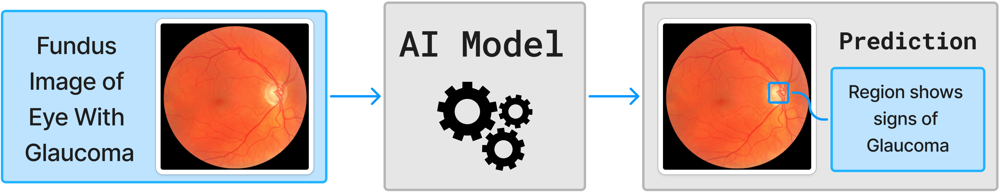
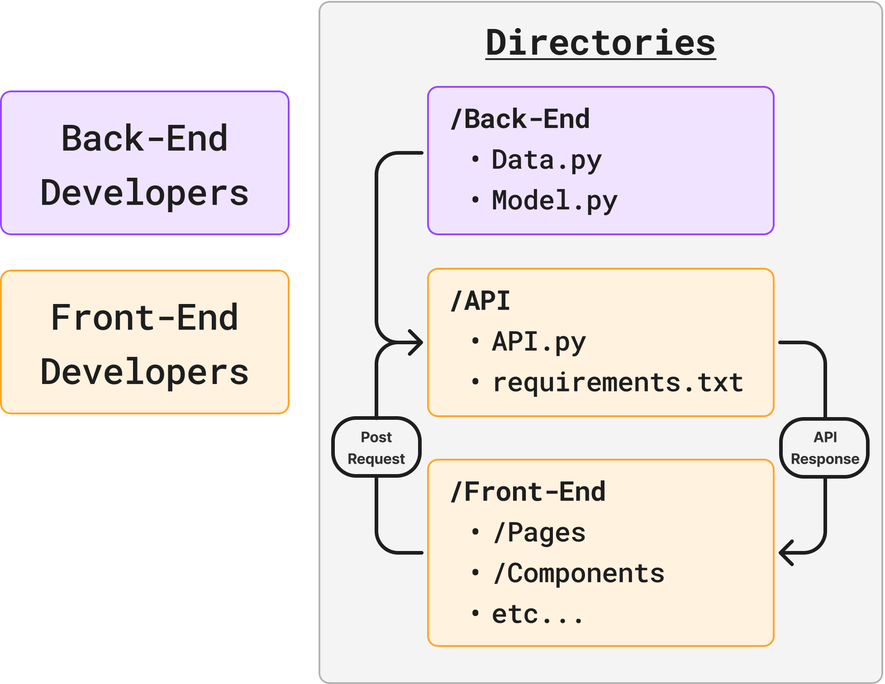
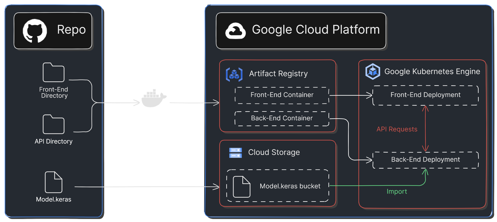

# Ocular Disease Identifier Planning & Documentation 

## Table of Contents
  * [:bulb: Project Description](#bulb-project-description)
  * [:compass: Implementation Plan](#compass-implementation-plan)
  * [:clipboard: Team Management](#clipboard-team-management)
  * [:athletic_shoe: Sprint Planning](#athletic_shoe-sprint-planning)

## :bulb: Project Description

### Problem Statement
Did you know that over 30% of Canadians over the age of 65 suffer from ocular diseases such as glaucoma, cataracts, and diabetic retinopathy [1]? Unfortunately, many cases go undiagnosed since it is difficult for opthalmologists to detect these diseases, particularly in their early stages. Although these diseases are more prevalent in the elderly community, they affect people of all demographics and ages. When left untreated, symptoms of eye disease can quickly worsen, potentially leading to blindness. But what if there were a way to change this? Imagine if we could use machine learning to combat this issue by creating a tool that could help identify these diseases.

The goal of the ocular disease identifier is to both detect any symptoms of ocular disease that go unnoticed during examination, and be able to offer a valid second opinion. This project does not aim to replace professional eye examinations, but is rather meant to act as a failsafe mechanism that accounts for human error. To ensure real world usability, the identifier should be accurate, simple to use, and store any patient information securely and in compliance with standard privacy policies.

### Objectives
1. Build and train an AI model to identify ocular diseases using patient fundus images (see Figure 1 below).
2. Develop a secure web application that allows Opthalmologists to efficiently access the AI model.

<em>Figure 1: High Level Overview of Project Back-End.</em>

### Stakeholders

- Opthalmologists
- Undiagnosed ocular disease patients

## :compass: Implementation Plan

### Project Timeline

- **Milestone 1 (MVP-Backend):** Build a convolutional neural network (CNN) using TensorFlow. Train the model using a public dataset. The model should be functioning for ***only one*** ocular disease (Ex. Glaucoma) at this point.
Date to be completed by: *TBD*
- **Milestone 1 (MVP-Frontend):** Develop an API using a Python framework (Ex. Flask, Django, etc.). Develop a user-friendly, and functional web application that is able to handle requests to the API. The frontend application must be able to accept image files and submit them to the API.
Date to be completed by: *TBD*
- **Milestone 2:** Increase the number of diseases that the model can identify. Analyze potential weaknesses of the model, and modify accordingly to increase overall accuracy. Increase functionality of the web application; implement additional features such as ability to login, drag and drop file upload, and possibly storing of patient information. Note: This would require a database. Date to be completed by: *TBD*
- **Milestone 3 :** Implement additional image processing, so that the model will inform the user of the location of the disease (See Figure 2). Deploy the application. Date to be completed by: *TBD*

<em>Figure 2: Example of Milestone 4 Back-End Improvements.</em>

### Tech Stack
*Note: The project is ***not*** limited to the technologies listed below, but many **will** be required for this project!*

- **Frontend Framework Options:**
  - Web Application:    
  - API:    

- **Backend Framework:**
   

- **Other Technologies/Libraries:**
  - Data Processing:   

  - Hosting & Deployment Tools:   

  - Styling Tools:    

### Project Structure :open_file_folder:
Backend devs will work in the backend directory in which the model will be developed. The model will then be integrated into the API directory that will be developed by the frontend devs. The frontend can then access the model through the API, and receive a response accordingly. 

<em>Figure 3: Potential Structure of Project.</em>

### Deployment Plan

<em>Figure 4: Architecture Diagram.</em>

## :clipboard: Team Management

### Team Members

- **Scrum Master & Product Owner:** [Kristian Diana](https://github.com/kristiandiana)
- **Frontend & API Developers (3):**
  - [Name TBD]
  - [Name TBD]
  - [Name TBD]
- **Backend Developers (3):**
  - [Name TBD]
  - [Name TBD]
  - [Name TBD]

  

### Team Communication

- **Communication Platform:** Discord
- **Meeting Schedule:**
  - Sprint Review: [Weekly]
  - Sprint Retrospective: [Weekly]
  - Other Meetings: [Potential for in-person coding sessions depending on team availability]

### Roles and Responsibilities
*This section defines the responsibility of each role, you may edit to fit your project's needs.*

- **Scrum Master:**
  - Flush out project's boilerplate 
  - Assign tickets to developers
  - Facilitate scrum ceremonies (sprint reviews, retrospectives)
  - Remove impediments
- **Product Owner:**
  - Define product backlog 
  - Prioritize user stories
  - Accept/reject deliverables
- **Developers:**
  - Develop features through ticket completion
  - Create test cases to for feature/ticket acceptance
  - Thoroughly document code and features through pull requests and README docs
  - Execute tests
  - Report defects

### Collaboration Tools
We will be using GitHub Projects as a way to organize our project as use of this system will make it easy for us to adhere to the Scrum framework. We will use a Kanban Board style system which will allow sprint progress to be easily monitored. Issues will be assigned to developers, and are expected to be completed by a designated due date. Developers will work in a branch, then submit a pull request to be reviewed by the Scrum Master before being merged to the main branch, ultimately closing the respective issue. 

### Code Acceptance: The Definition of Done

Below we define the Definition of Done for this project, i.e. what needs to the included in a pull request for the pull request to be accepted by the Product Owner:
- Code Complete (satisfies feature associated to the ticket)
- Passed Code Review by Scrum Master
- Passed Unit Tests/Other testing developed for the feature
- Documentation Updated (Sufficient Commenting)
- Ready to be integrated with Main Branch (no merge conflicts)

## :athletic_shoe: Sprint Planning

### <u>Milestone 1 (Back-End MVP)</u>

Build a convolutional neural network (CNN) using TensorFlow. Train the model using a public dataset. The model should be functioning for ***only one*** ocular disease (Ex. Glaucoma) at this point.

**Sprint 1-2**: 
- Select a public ocular disease dataset that includes fundus images to be used as training data, such as the following [Kaggle Dataset](https://www.kaggle.com/datasets/andrewmvd/ocular-disease-recognition-odir5k). 
- Use pandas to access the data and NumPy format it in a dataframe that will be used later. 
- *Expected length of sprint: 2 weeks.* 

**Sprint 3-4**: 
- Organize the data into training and testing data. 
- Build the CNN and train the model on *one* ocular disease (binary image classification). 
- Assess the accuracy of the model using Matplotlib. Save the model. 
- *Expected length of sprint: 3-4 weeks.* 

**Sprint 5**: 
- Upload the saved model to a Google Cloud bucket. 
- Develop a Python function that imports the model from the bucket, and uses it to make predictions. Integrate this function with the Python API, ensuring that image parameters are reshaped correctly. 
- *Expected length of sprint: 3 weeks.* 

 
### <u>Milestone 1 (Front-End MVP)</u>

Develop an API using a Python framework (Ex. Flask, Django, etc.). Develop a web application that is able to handle requests to the API with image files. 

**Sprint 1-2**: 
- Select a Python framework to develop the API with (options listed above). 
- Develop an API within the /API directory that can handle POST requests with image files. Test the API using Postman. 
- *Expected length of sprint: 3 weeks.*

**Sprint 3-4**: 
- Create a design for the web app using Figma or other tool, and select a web development framework. 
- Develop the basic functionality of the web app in the /Front-End repository (must be able to upload image files). 
- *Expected length of sprint: 4 weeks.*

**Sprint 5**: 
- Integrate the API with the frontend by making a POST request to the API from the frontend. The frontend must be able to submit an image file to the API, and receive a JSON message back. 
- *Expected length of sprint: 2 weeks.*

### <u>Milestone 2</u>

**Sprint 6-7**: 
- Increase the number of diseases that the model is able to identify. 
- Improve frontend user experience using CSS framework of choice, and by implementing additional features such as drag and drop file upload. 
- *Expected length of sprint: 3 weeks.* 

**Sprint 8**: 
- Analyze potential weaknesses of the model, and modify accordingly to increase overall accuracy. Add ability to login on frontend and store profile information. 
- *Expected length of sprint: 3 weeks.*

### <u>Milestone 3</u>

**Sprint 9**: 
- Containerize both the API and Frontend, and deploy the application on GCP (see *Figure 4: Architecture Diagram*) 
- *Expected length of sprint: 3 weeks.* 

**Sprint 10**: 
- Perform additional image processing, such as image masking of the diseased location. 
- Additional frontend features, such as profile analytics. 
- *To be completed with remaining time.*

### Additional Information & Resources

*Here is some additional information on Sprint Planning and the Scrum Framework!*
- *[Atlassian: Sprint Planning](https://www.atlassian.com/agile/scrum/sprint-planning#:~:text=What%20is%20sprint%20planning%3F,with%20the%20whole%20scrum%20team.)*
- *[Scrum in 20 mins](https://www.youtube.com/watch?v=SWDhGSZNF9M&ab_channel=CodexCommunity)*

### Sources
[1] https://www150.statcan.gc.ca/n1/pub/82-003-x/2022012/article/00003-eng.htm
