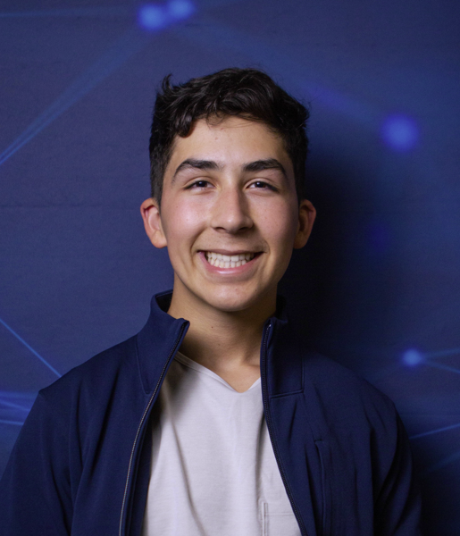
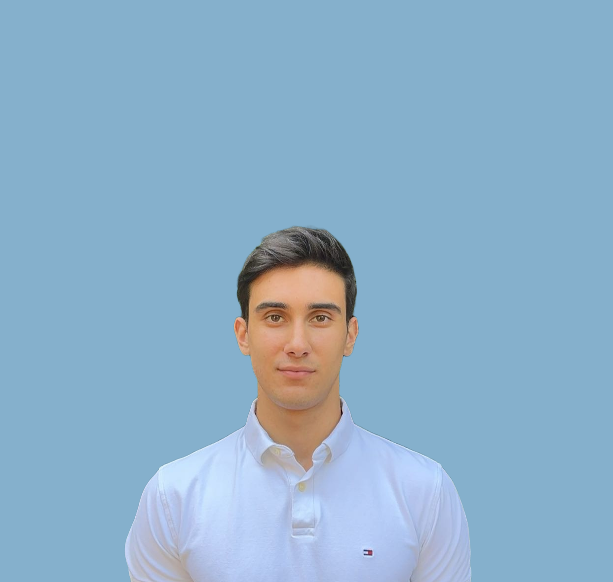
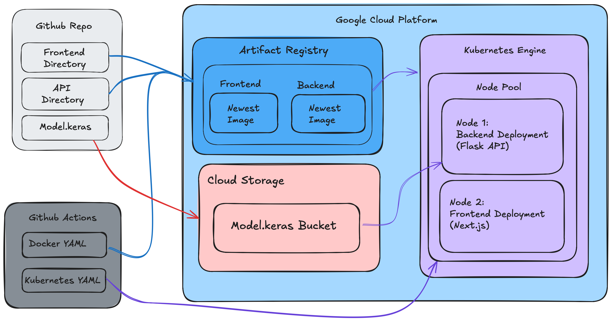

<h1 align="center">:eye: Ocular Disease Identifier :stethoscope:</h1>

  

## Project Overview :page_with_curl:

The **Ocular Disease Identifier** leverages AI to detect ocular diseases from fundus images, providing an accessible and innovative solution for healthcare professionals. This tool aims to enhance early diagnosis and treatment planning, ultimately improving patient outcomes.

### Key Features:
- **Accuracy**: Utilizes a high-performing convolutional neural network (CNN) to analyze fundus images effectively.
- **Accessibility**: Offers a user-friendly web application for seamless interaction with the AI model.
- **Real-World Impact**: Designed to integrate with clinical workflows, supporting healthcare professionals in making informed decisions.

---

## Contributors :handshake:

| Contributor                                                                                                     | Expertise & Tools                                                                                                                                                                                                                                   | Notable Contributions                                                                                                                                                        |
| --------------------------------------------------------------------------------------------------------------- | --------------------------------------------------------------------------------------------------------------------------------------------------------------------------------------------------------------------------------------------------- | --------------------------------------------------------------------------------------------------------------------------------------------------------------------------- |
|    [**Kristian Diana**](https://github.com/kristiandiana)  <i>Project Lead</i> |    | - [#20 Integrate all elements for the first project showcase demo](https://github.com/<your-repo>/issues/20)   - Managing team using agile/scrum methodologies and Kanban boards |
|    [**Alex Chen**](https://github.com/alexchen2)  <i>ML/AI Engineer</i> |    | - Model training   - Data preprocessing pipelines                                                                                                                       |
|    [**Iain MacDonald**](https://github.com/IainMac32)  <i>Full-Stack Developer</i> |     | - Frontend components development   - API integrations                                                                                                                   |
|    [**Jasimraza Momin**](https://github.com/JasimrazaMomin)  <i>Cloud/DevOps Engineer</i> |    | - CI/CD pipelines   - Cloud deployment                                                                                                                                |
|    [**George Ghiugan**](https://github.com/ghiugan)  <i>Full-Stack Developer</i> |     | - User authentication   - Bug fixes                                                                                                                                    |
|    [**Maheer Huq**](https://github.com/Maheer96)  <i>Full-Stack Developer</i> |     | - Responsive design   - Performance optimization                                                                                                                        |
|    [**Nick Zajskeskovic**](https://github.com/nzajk)  <i>Cloud/DevOps Engineer</i> |    | - Placeholder contributions                                                                                                                                           |
| [**Samuel Shi**](https://github.com/sokosam)  <i>Full-Stack Developer</i> |     | - UI enhancements   - Component-level testing                                                                                                                       |
| [**Vikram Chandar**](https://github.com/vikramC04)  <i>ML/AI Engineer</i> |    | - Model evaluation and testing   - Data augmentation pipelines                                                                                                           |

---

## Architecture Diagram

## For More Information.....
### [View the Project Roadmap](./PROJECT-ROADMAP.md)

