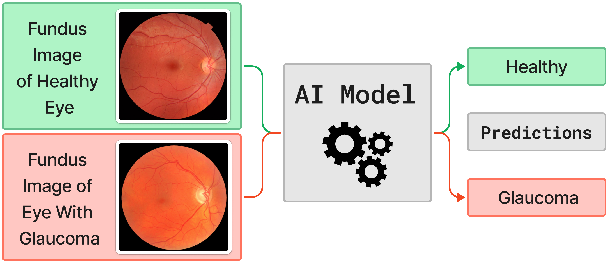
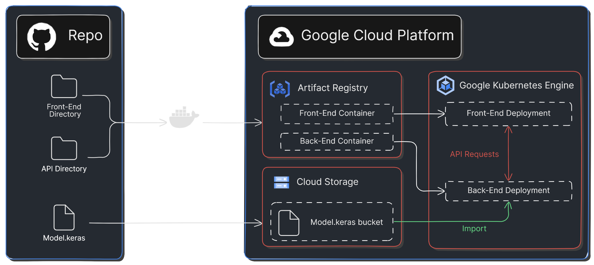

<h1 align="center"> :eye: Ocular Disease Identifier :stethoscope:</h1>

*Hello, and welcome to one of the 2024 McMaster GDSC Open Source project repos! Project Lead: [Kristian Diana](https://github.com/kristiandiana).*

## :loudspeaker: Attention :bangbang:

If **you** are interested in learning about how AI can be used a difference in the healthcare field, then you are in the right place! Whether you are interested in machine learning, web development, or API development, this project has something for you! 

## Project Overview :page_with_curl: 

The **ocular disease identifier** project involves developing an AI model that can predict whether common ocular diseases are present in a fundus image (see *Figure 1*). A user-friendly web application will be developed to provide easy access to the model.

 

<em>Figure 1: High Level Visualization of Project.</em>

 

The team will comprise of two sub-teams; the Frontend sub-team, and the Backend sub-team. As a brief summary, the main focus of each sub-team is as follows. The Frontend sub-team is responsible for the development of the web application, as well as an API using a Python framework. The Backend sub-team is responsible for the development of a convolutional neural network (CNN) using TensorFlow. The model is to be trained using a publicly sourced dataset. If you are curious about how GCP will be used in this project, see *Figure 2* below! For more information about the project, please see the attached [Planning Document](./PLAN.md) which includes a detailed [Sprint Plan](./PLAN.md#sprint-planning) and proposed [Tech Stack](./PLAN.md#tech-stack) for the project.

 

<em>Figure 2: Architecture Diagram.</em>

## Available Developer Positions :busts_in_silhouette:

There will be ***3 available positions for each of the two sub-teams*** indicated above (6 total). As a side note, being assigned to a specific sub-team does **not** necessarily mean you will not learn about the other, however it **is** where the bulk of your contributions will be made. Students of all years are encouraged to apply!

## For More Information...
### [View the Planning Document](./PLAN.md)

