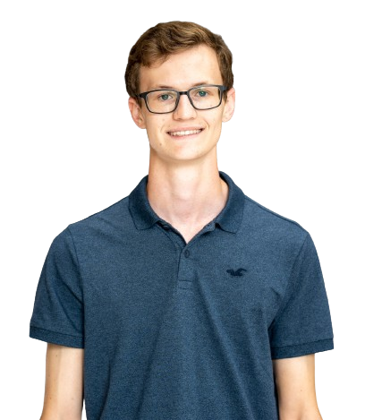

<h1 align="center"> :eye: Ocular Disease Identifier :stethoscope:</h1>

  

## Project Overview :page_with_curl: 

The **Ocular Disease Identifier** leverages AI to detect ocular diseases from fundus images, offering an accessible and innovative solution for healthcare professionals. With this tool, we aim to enhance early diagnosis and treatment planning, ultimately improving patient outcomes.

Our approach combines:
**Accuracy**: A high-performing convolutional neural network (CNN) to analyze fundus images.
**Accessibility**: A user-friendly web application for seamless interaction with the AI model.
**Real-World Impact**: Designed to be adopted in clinical workflows and aid healthcare professionals.

| Contributor                                                                                                     | Most Used Frameworks/Tools                                                                                                                                                                                                                                    | Notable Contributions                                                                                                                                                                                          |
| --------------------------------------------------------------------------------------------------------------- | ------------------------------------------------------------------------------------------------------------------------------------------------------------------------------------------------------------------------------------------------------------ | --------------------------------------------------------------------------------------------------------------------------------------------------------------------------------------------------------------- |
|    [**Kristian Diana**](https://github.com/kristiandiana)   <i>Project Lead</i> |           | <ul><li>[#1: Initial Setup](https://github.com/DSC-McMaster-U/DBAC-Companion-App/)</li><li>[#2: Cloud Architecture Design](https://github.com/DSC-McMaster-U/DBAC-Companion-App/)</li></ul> |
|    [**Alex Chen**](https://github.com/alexchen2)   <i>ML/AI Engineer</i> |    | <ul><li>[#3: Model Training](https://github.com/DSC-McMaster-U/DBAC-Companion-App/)</li><li>[#4: Data Preprocessing Pipelines](https://github.com/DSC-McMaster-U/DBAC-Companion-App/)</li></ul> |
|    [**Iain MacDonald**](https://github.com/IainMac32)   <i>Full-stack Developer</i> |     | <ul><li>[#5: Frontend Components](https://github.com/DSC-McMaster-U/DBAC-Companion-App/)</li><li>[#6: API Integrations](https://github.com/DSC-McMaster-U/DBAC-Companion-App/)</li></ul> |
|    [**Jasimraza Momin**](https://github.com/JasimrazaMomin)   <i>Cloud/DevOps Engineer</i> |    | <ul><li>[#7: CI/CD Pipelines](https://github.com/DSC-McMaster-U/DBAC-Companion-App/)</li><li>[#8: Cloud Deployment](https://github.com/DSC-McMaster-U/DBAC-Companion-App/)</li></ul> |
|    [**George Ghiugan**](https://github.com/ghiugan)   <i>Full-stack Developer</i> |     | <ul><li>[#9: User Authentication](https://github.com/DSC-McMaster-U/DBAC-Companion-App/)</li><li>[#10: Bug Fixes](https://github.com/DSC-McMaster-U/DBAC-Companion-App/)</li></ul> |
|    [**Maheer Huq**](https://github.com/Maheer96)   <i>Full-stack Developer</i> |     | <ul><li>[#11: Responsive Design](https://github.com/DSC-McMaster-U/DBAC-Companion-App/)</li><li>[#12: Performance Optimization](https://github.com/DSC-McMaster-U/DBAC-Companion-App/)</li></ul> |
|    [**Nick Zajskeskovic**](https://github.com/nzajk)   <i>Cloud/DevOps Engineer</i> |  | <ul><li>[#9: Placeholder](https://github.com/DSC-McMaster-U/DBAC-Companion-App/)</li><li>[#10: Placeholder](https://github.com/DSC-McMaster-U/DBAC-Companion-App/)</li></ul> |

|    [**Samuel Shi**](https://github.com/sokosam)   <i>Full-stack Developer</i> |  | <ul><li>[#11: Placeholder](https://github.com/DSC-McMaster-U/DBAC-Companion-App/)</li><li>[#12: Placeholder](https://github.com/DSC-McMaster-U/DBAC-Companion-App/)</li></ul> |

|    [**Vikram Chandar**](https://github.com/vikramC04)   <i>ML/AI Engineer</i> |  | <ul><li>[#13: Placeholder](https://github.com/DSC-McMaster-U/DBAC-Companion-App/)</li><li>[#14: Placeholder](https://github.com/DSC-McMaster-U/DBAC-Companion-App/)</li></ul> |

## For More Information.....
### [View the Project Roadmap](./PROJECT-ROADMAP.md)

